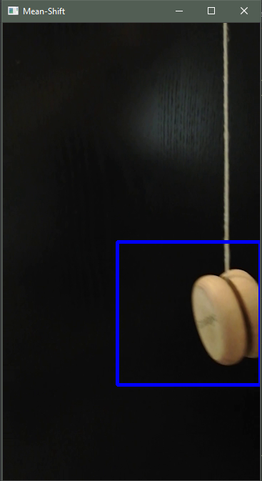

## MAIN IDEA
Using meanshift and camshift algorithm to track an object.

## USAGE
Mark object which you want to track with your mouse, object must located within borders. Then watch how algorithm will track your object.

## RESULTS

|Meanshift example 1    |  Camshift example 1 |  Camshift example 2 |
:-------------------------:|:-------------------------:|:-------------------------:|:-------------------------:
  |    | |   
